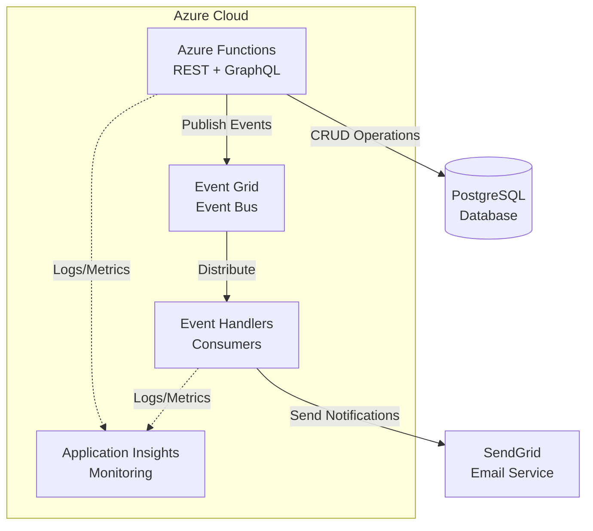

# Sistema de Inventario Agranelos - Backend API

Backend serverless para sistema de gestion de inventario implementado con Azure Functions, Event Grid y PostgreSQL.

[](./docs/DEPLOY.md)
[](https://adoptium.net/)
[](https://azure.microsoft.com/services/functions/)
[](https://www.postgresql.org/)

## Descripcion

Sistema backend cloud-native para gestion de inventario que proporciona:
- APIs duales (REST y GraphQL) para operaciones CRUD
- Arquitectura orientada a eventos con Azure Event Grid
- Escalabilidad automatica con Azure Functions (Serverless)
- Procesamiento asincrono de eventos de negocio
- Notificaciones por email con SendGrid

## Arquitectura



## Caracteristicas Principales

- **API Dual**: REST y GraphQL en la misma infraestructura
- **Cloud Native**: Desplegado en Azure Functions (Serverless)
- **Event-Driven**: Arquitectura orientada a eventos con Azure Event Grid
- **Base de Datos**: PostgreSQL con connection pooling (HikariCP)
- **Notificaciones**: Sistema de emails automaticos con SendGrid
- **Observabilidad**: Application Insights para monitoreo
- **CI/CD**: GitHub Actions para despliegue automatico
- **Testing**: Scripts automatizados y coleccion Postman
- **IaC**: ARM Templates para infraestructura como codigo

## Stack Tecnologico

- **Runtime**: Java 11
- **Framework**: Azure Functions
- **APIs**: REST + GraphQL (graphql-java)
- **Base de Datos**: PostgreSQL 13+
- **Event Bus**: Azure Event Grid
- **Email**: SendGrid
- **Monitoring**: Azure Application Insights
- **CI/CD**: GitHub Actions
- **IaC**: ARM Templates

## Inicio Rapido

### Prerequisitos

- Java 11+
- Maven 3.8+
- Azure Functions Core Tools 4.x
- Cuenta de Azure
- PostgreSQL 13+

### Instalacion Local

1. Clonar el repositorio:
```bash
git clone https://github.com/DiegoBarrosA/agranelos-functions-crud.git
cd agranelos-functions-crud
```

2. Configurar variables de entorno:
```bash
cp local.settings.json.template local.settings.json
# Editar local.settings.json con tus credenciales
```

3. Compilar y ejecutar:
```bash
mvn clean package
mvn azure-functions:run
```

### Despliegue en Azure

Ver la [Guia de Despliegue](./docs/DEPLOY.md) completa.

```bash
mvn azure-functions:deploy
```

## Documentacion

- [Documentacion Completa](https://diegobarrosa.github.io/agranelos-functions-crud/)
- [Arquitectura Detallada](./docs/ARQUITECTURA.md)
- [Guia de Despliegue](./docs/DEPLOY.md)
- [Event Grid Setup](./docs/EVENT_GRID_SETUP.md)
- [Testing de Event Grid](./docs/EVENT_GRID_TESTING.md)
- [Configuracion de Email](./docs/EMAIL_SETUP.md)
- [Referencia Rapida API](./docs/quick-reference.md)

## APIs Disponibles

### REST API
- `GET /api/productos` - Listar productos
- `POST /api/productos` - Crear producto
- `GET /api/productos/{id}` - Obtener producto
- `PUT /api/productos/{id}` - Actualizar producto
- `DELETE /api/productos/{id}` - Eliminar producto

### GraphQL API
- Endpoint: `/api/graphql`
- Introspection habilitada
- Schema completo disponible en [schema.graphqls](./src/main/resources/schema.graphqls)

Ver [Referencia Rapida](./docs/quick-reference.md) para ejemplos detallados.

## Eventos del Sistema

El sistema publica eventos en Azure Event Grid:

| Evento | Descripcion | Acciones |
|--------|-------------|----------|
| `ProductoCreado` | Nuevo producto creado | Email de notificacion |
| `ProductoActualizado` | Producto modificado | Email de notificacion |
| `ProductoEliminado` | Producto eliminado | Email de notificacion |
| `BodegaCreada` | Nueva bodega creada | Email de notificacion |
| `BodegaActualizada` | Bodega modificada | Email de notificacion |
| `BodegaEliminada` | Bodega eliminada | Email de notificacion |

## Testing

### Testing Containerizado con Podman (Recomendado)
```bash
# Ejecutar todas las pruebas en contenedor
./test-podman.sh

# Reconstruir imagen y ejecutar
./test-podman.sh --rebuild

# Testing contra produccion (con confirmacion)
./test-podman.sh --confirm-production
```

### Scripts Nativos (Alternativo)
```bash
# Si Podman no esta disponible
./test-podman.sh --native

# O directamente
cd scripts/testing
./test-all-apis.sh
./test-eventgrid.sh
```

### Testing con Docker Compose
```bash
# Para testing automatizado (incluye BFF microservice)
docker-compose --profile testing up api-tests

# Para desarrollo local solamente
docker-compose --profile local up bff-microservice-local

# Ver logs del testing
docker-compose --profile testing logs -f api-tests
```

### Coleccion Postman
Importar desde `postman/Agranelos-Inventario-API-Collection.postman_collection.json`

## Estructura del Proyecto

```
.
├── src/
│   ├── main/
│   │   ├── java/com/agranelos/inventario/
│   │   │   ├── Function.java          # Azure Functions endpoints
│   │   │   ├── events/                # Event Grid publishers & consumers
│   │   │   ├── models/                # Domain models
│   │   │   └── services/              # Business logic services
│   │   └── resources/
│   │       └── schema.graphqls        # GraphQL schema
│   └── test/                          # Unit tests
├── docs/                              # Documentacion
├── scripts/testing/                   # Scripts de prueba
├── postman/                           # Coleccion Postman
├── azure-deploy.json                  # ARM Template
└── pom.xml                           # Maven configuration
```

## Contribuir

Este es un proyecto universitario para DuocUC. Las contribuciones son bienvenidas:

1. Fork el proyecto
2. Crear una rama (`git checkout -b feature/nueva-funcionalidad`)
3. Commit cambios (`git commit -m 'Agregar nueva funcionalidad'`)
4. Push a la rama (`git push origin feature/nueva-funcionalidad`)
5. Abrir un Pull Request

## Licencia

MIT License - ver [LICENSE](LICENSE) para detalles

## Autor

**Diego Barros**
- Email: di.barros@duocuc.cl
- GitHub: [@DiegoBarrosA](https://github.com/DiegoBarrosA)
- Universidad: DuocUC

---

**Nota**: Proyecto desarrollado con asistencia de GitHub Copilot (GPT-4)
